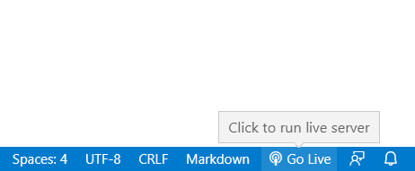

# COMPUTER GRAPHICS CS105 
## CAPSTONE PROJECT 

### Requirements 
* Install Visual Studio Code (VSCode) 
* Install Live Server Extension on VSCode  

### Usage 
Open `index.html` in VSCode & click on Go Live

 

### BUG 
There will be bugs with Light Control when switching to different light sources so please refresh the page if you face it. 